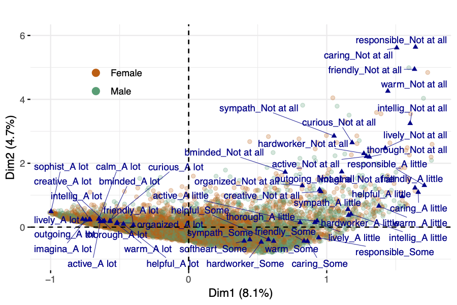

# logoleft_name: https&#58;//raw.githubusercontent.com/brentthorne/posterdown/master/images/betterhexlogo.png
output: 
  posterdown::posterdown_html:
    self_contained: false
bibliography: packages.bib
---

```{r setup, include=FALSE}
knitr::opts_chunk$set(echo = FALSE)
```

# Introduction

The main focus of this work is to show the ability of geometric data analysis techniques in discovering response patterns in survey data where the majority of measurements result in categorical variables.
 
# Methods

The geometric data analysis method of Multiple Correspondence Analysis (MCA) allows the construction of a lower dimensional space that captures the variance in the original data, and in which both variables and individuals can be projected to explore patterns, validate hypotheses, and better understand the association among the observed data.

MCA is an unsupervised learning algorithm under the framework of Geometric Data Analysis (GDA), in which the elements of two sets indexing the entries of the data table become points in a geometric space and define two clouds of points: a cloud of categories and a cloud of individuals (Fig. 1). The distance between individual points is a reflection of the dissimilarity between response patterns of individuals, and both resulting clouds are on the same distance scale (B. Le Roux/2010).

The traditional data format for MCA is an Individuals $\times$ Questions rectangular table, where questions are categorical

variables with a finite number of categories (also called levels), and for each question, each individual chooses one and only one response category. Categories may be qualitative (nominal or ordinal) or may result from the splitting of continuous variables into categories.

MCA can be seen as a particular case of weighted principal component analysis, in which a set of multidimensional points exists in a high-dimensional space where distance is measured by a weighted Euclidean metric and the points themselves have differential masses. A lower dimensional solution is obtained by determining the closest plane to the points in terms of weighted least-squared distance, and then projecting the points onto the plane for visualization and interpretation. The lowdimensional subspace that fits the points as closely as possible can be obtained compactly and neatly using the generalized singular-value decomposition (SVD) of the data matrix.


<!-- \begin{figure}[!t]  -->
<!-- \centering  -->
<!-- \includegraphics[width=3.5in]{figs/mcaIdeaNew.pdf} -->
<!-- \caption{Clouds of points generated by MCA} -->
<!-- \label{fig:fig_MCAillustration}  -->
<!-- \end{figure} -->

```{r mcaIdea, out.width='60%', fig.align='center', fig.cap='MCA idea', fig.height=5}
knitr::include_graphics("figs/MCAplot.png")
```

The squared distance between two respondents is calculated using the variables for which each had chosen different categories.

\begin{equation}
\begin{aligned}[b]
\label{eq:distInd}
d^2(i, i^{\prime}) &= \frac{1}{Q} \sum_{k\in K} \frac{(\delta_{ik} - \delta_{i^{\prime}k})^2}{f_k}  
\end{aligned}
\end{equation}

where $\delta_{ik} = 1$ if $i$ has chosen $k$ and $0$ otherwise. Notice that the smaller the frequencies of disagreement categories, the greater the distance between individuals. The set of all distances between individuals determines the cloud of individuals consisting of $N$ points in a space with dimensionality $L\leq K - Q$ \cite{greenacre2006multiple} (it is assumed here that $N > L$). Additionally, if respondent $i$ chooses infrequent categories, then the point $M^i$ representing individual $i$ is far from the mean center of the cloud $G$. The squared distance from point $M^i$ to $G$ is given by 

\begin{equation}
\begin{aligned}[b]
\label{eq:distGM}
(GM^i)^2 &= \left( \frac{1}{Q} \sum_{k\in K} \frac{\delta_{ik}}{f_k}  \right) -1
\end{aligned}
\end{equation}

In the cloud of categories, a weighted cloud of $K$ points, category $k$ is denoted by point $M^k$ with weight $n_k$: For each question, the sum of the weights of category points is $N$, and the relative weight $p_k$ of point $M^k$ is simply $p_k = f_k=Q$.

Given two categories $k$ and $k^\prime$, the squared distance between the points $M^k$ and $M^{k^\prime}$ is calculated as

\begin{equation}
\begin{aligned}[b]
\label{eq:distCat}
(M^k, M^{k^{\prime}})^2 &= \frac{n_k + n_{k^\prime} - 2 n_{kk^\prime} }{n_k n_{k^\prime}/N}
\end{aligned}
\end{equation}

with $n_{kk^\prime}$ denoting the number of respondents who have chosen both categories $k$ and $k^\prime.$

The contribution of a category point $M^k$ to the overall variance is the ratio of the amount of the variance of the cloud due to category $k$. The contribution of a question $q$ is the sum of the contributions of its categories. Contributions can be calculated as shown below:

\begin{equation}
\begin{aligned}[b]
\label{eq:contribMk}
\text{Ctr}_k &= \frac{1-f_k}{K-Q}, \quad \text{Ctr}_q = \frac{K_q -1 }{K-Q}
\end{aligned}
\end{equation}


# The HRS Dataset

Created in 1990 and launched in 1992 by the National Institute on Aging (NIA) and Social Security Administration, the Health and Retirement Study (HRS) surveys collect every two years of data from more than 22,000 Americans over 50 years old. It is the first longitudinal study of Americans approaching the economic and health aspects in the same survey and being the largest nationally representative multidisciplinary panel study of Americans aged 50 and older. The study was created and maintained by the Institute for Social Research (ISR) Survey Research Center (SRC) at the University of Michigan.


# Results and Discussion

MCA was performed on a combined dataset from respondents of the 2008 and 2010 waves. Notice that the participants of the 2008 survey are different than those from the 2010 survey. The clouds patterns for every wave were examined to confirm that the overall geometric representations were similar regardless of the number of participants in each wave, or the year in which the survey responses were collected.

You can reference tables like so: Table \@ref(tab:mytable). 

\begin{table}
\caption{Response frequencies (absolute $n_k$ and relative $f_k$), and contributions ($\text{Ctr}_k$) of  top categories by $\text{Ctr}_k$ and levels} 
\centering
\begin{tabular}{lrrr}
  \hline
  Category & nk & fk & ctrk \\ 
  \hline
  sophisticated\_Not at all & 2159 & 0.22 & 0.0093 \\ 
  imaginative\_A lot & 3109 & 0.32 & 0.0081 \\ 
  creative\_A lot & 2668 & 0.27 & 0.0086 \\ 
  caring\_A little & 345 & 0.04 & 0.011 \\ 
  talkactive\_A lot & 2823 & 0.29 & 0.0085 \\ 
  friendly\_A little & 372 & 0.04 & 0.011 \\ 
  careless\_Some & 993 & 0.10 & 0.011 \\ 
  responsible\_Some & 1729 & 0.18 & 0.0098 \\ 
  responsible\_A little & 236 & 0.02 & 0.012 \\ 
  nervous\_Not at all & 3101 & 0.32 & 0.0081 \\ 
  worry\_Not at all & 1625 & 0.17 & 0.0099 \\ 
  moody\_Some & 1470 & 0.15 & 0.01 \\ 
   \hline
\end{tabular}
\label{tab:fknkTop12}
\end{table}

`NEED TO ADD TABLES TO POSTER`

<!-- \begin{figure}[h!]  -->
<!-- \centering  -->
<!-- \includegraphics[width=3in]{../figs/newbiplot12.pdf} -->
<!-- \caption{Projection onto the first two principal dimensions} -->
<!-- \label{fig:biplot}  -->
<!-- \end{figure}  -->

```{r biplot12, out.width='60%', fig.align='center', fig.cap='Biplot first two principal coordinates', fig.height=5}
# 
```

# Clustering

Geometric data analysis methods have the potential to be used as a pre-processing step for clustering, given the representation in a lower dimensional space provided by the principal component technique of choice. In this work, a hierarchical clustering algorithm is performed using the coordinates of each respondent in the lower dimensional space generated by the MCA procedure.

The findings of this hierarchical clustering confirm a natural grouping for the participants of the survey: the tendency of survey respondent to use the levels of agreement with the different questions that are part of the questionnaire, namely, &quot;a lot&quot;, &quot;not at all&quot;, &quot;some&quot; and &quot;a little&quot;. These levels of agreements are well separated in distinct regions within the plane of the first 2 principal dimensions.

<!-- \begin{figure}[h!]  -->
<!-- \centering  -->
<!-- \includegraphics[width=3.2in]{../figs/new_hclust.pdf} -->
<!-- \caption{Hierarchical clustering using principal dimensions generated by multiple correspondence analysis.} -->
<!-- \label{fig:hclust}  -->
<!-- \end{figure}  -->


```{r hclust, out.width='50%', fig.align='center', fig.cap='Hierarchical Clustering', fig.height=5, fig.show='hold'}
knitr::include_graphics(c("figs/screeplot.png",
                          "figs/new_hclust.png"))
```

```{r, echo = FALSE}
png1_dest <- "figs/region_1_plot.png"
png2_dest <- "figs/region_2_plot.png"
png3_dest <- "figs/region_3_plot.png"
png4_dest <- "figs/region_4_plot.png"
```


```{r regions12, out.width='50%', fig.align='center', fig.cap='Regions', fig.height=5, fig.show='hold'}
knitr::include_graphics(c(png1_dest,
                          png2_dest, 
                          png3_dest,
                          png4_dest))
# knitr::include_graphics(c(png3_dest,png4_dest))
```


# Conclusions

The use of unsupervised techniques presented in this work represents an opportunity to extract valuable insights from longitudinal datasets like the one made available by the US Health and Retirement Study. MCA allows for new interpretations and discovery of patterns that take advantage of the qualitative nature of the data collected from survey respondents. The hierarchical clustering technique applied to the low dimensional representation of participants, provided by the MCA method, suggested a reasonable separation of the respondent profile as

characterized by a personality scale. Results provided by this approach may be used to explore other areas that have yet to be captured using the items in the questionnaires, helping in the design of the survey and sampling procedure, and allowing for correlation studies with other physical and mental health indicators.

Praesent dictum mauris at diam maximus maximus [@R-posterdown].
`FactoMineR`, `tidyverse`

# Acknowledgements

The HRS (Health and Retirement Study) is sponsored by the National Institute on Aging (grant number NIA U01AG009740) and is conducted by the University of Michigan. The HRS has been approved by the Institutional Review Board at the University of Michigan. The HRS obtains in- formed verbal consent from voluntary participants and follows strict procedures to protect study participants from disclosure (including maintaining a Federal Certificate of Confidentiality). The public data, made available to registered researchers and used in this study, is de-identified.


```{r, include=FALSE}
knitr::write_bib(c('knitr','rmarkdown','posterdown','pagedown'), 'packages.bib')
```


# References


