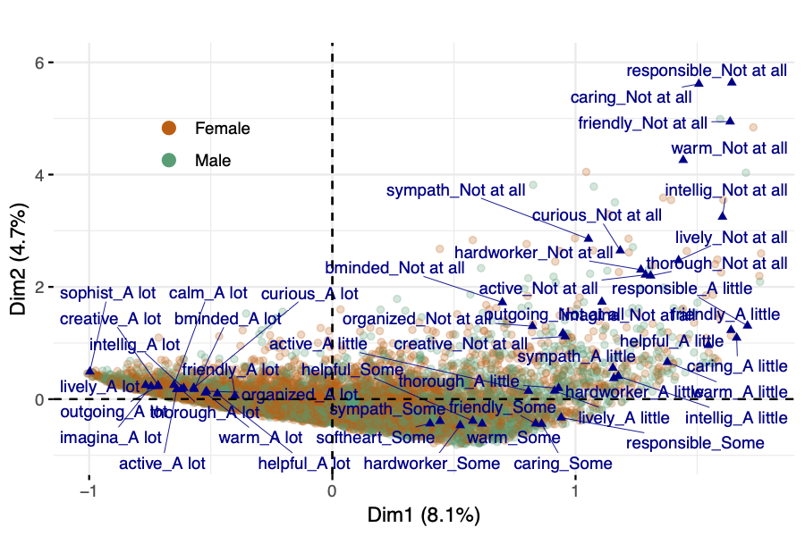

<!-- <style> -->
<!-- .logo_right { -->
<!--  float: right; -->
<!--  width: 20%; -->
<!--  height: 10%; -->
<!--  align-items: center; -->
<!--  justify-content: center; -->
<!-- } -->
<!-- </style> -->


<!-- <style> -->
<!-- .poster_body h1 { -->
<!--         color:  #B1B3B5; -->
<!-- } -->
<!-- </style> -->

<style>
.poster_title{
color: #532d8e;
}
</style>


<style>
.poster_title h5{
color: #532d8e;
font-size: 45pt;
}
</style>


<style>
.poster_title h3{
color: #000000;
}
</style>


<style>
.title_container {
background-color: #ffffff;
}
</style>
<style>
.logo_right {
background-color: #ffffff;
}
</style>
<style>
.logo_left {
background-color: #ffffff;
}
</style>


```{r setup, include=FALSE}
knitr::opts_chunk$set(echo = FALSE)
# packages
library(readxl)
library(magrittr)
library(knitr)
library(kableExtra)
```


# Introduction

The main focus of this work is to show the ability of geometric data analysis techniques in discovering response patterns in survey data where the majority of measurements result in categorical variables. A lower dimensional representation of both individuals and measured variables is used to detect and represent underlying structures in the US Health and Retirement Study, a longitudinal survey of a representative sample of Americans over age 50 that captures information on how changing health interacts with social, economic, and psychological factors and retirement decisions.

 
# Methods

<!-- The geometric data analysis method of Multiple Correspondence Analysis (MCA) allows the construction of a lower dimensional space that captures the variance in the original data, and in which both variables and individuals can be projected to explore patterns, validate hypotheses, and better understand the association among the observed data. MCA is an unsupervised learning algorithm under the framework of Geometric Data Analysis (GDA), in which the elements of two sets indexing the entries of the data table become points in a geometric space and define two clouds of points: a _cloud of categories_ and a _cloud of individuals_ (Figure \@ref(fig:mcaIdea)). The distance between individual points is a reflection of the _dissimilarity between response patterns_ of individuals, and both resulting clouds are on the same distance scale. -->

The geometric data analysis method of Multiple Correspondence Analysis (MCA) allows the construction of a lower dimensional space that captures the variance in the original data, and in which both variables and individuals can be projected to explore patterns, validate hypotheses, and better understand the association among the observed data. MCA is an unsupervised learning algorithm under the framework of Geometric Data Analysis (GDA), in which the elements of two sets indexing the entries of the data table become points in a geometric space and define two clouds of points: a _cloud of categories_ and a _cloud of individuals_ (Figure \@ref(fig:mcaIdea)). The distance between individual points is a reflection of the _dissimilarity between response patterns_ of individuals, and both resulting clouds are on the same distance scale [@le2010multiple].

```{r mcaIdea, out.width='80%', fig.align='center', fig.cap='MCA idea: representation of participants and responses to survey', fig.height=5}
knitr::include_graphics("figs/MCAplot.png")
```

<!-- MCA can be seen as a particular case of weighted principal component analysis, in which a set of multidimensional points exists in a high-dimensional space where distance is measured by a weighted Euclidean metric and the points themselves have differential masses. -->
The lower dimensional representation is obtained by determining the closest plane to the points in terms of weighted least-squared distance, and then projecting the points onto the plane for visualization and interpretation. The solution can be obtained compactly and neatly using the generalized singular value decomposition (SVD) of the data matrix [@greenacre2006multiple].


<!-- \begin{figure}[!t]  -->
<!-- \centering  -->
<!-- \includegraphics[width=3.5in]{figs/mcaIdeaNew.pdf} -->
<!-- \caption{Clouds of points generated by MCA} -->
<!-- \label{fig:fig_MCAillustration}  -->
<!-- \end{figure} -->

Let $\mathcal{I}$ be the set of $N$ individuals and $\mathcal{Q}$ the set of questions, encoded in $Q$ variables. The data used in the MCA approach is a $N \times Q$ matrix such that entry $(i, q)$ is the response category of the question $q$ chosen by individual $i$. Let $n_k$ be the number of respondents who chose category $k$, and $f_k = \frac{n_k}{N}$ the relative frequency of respondents who chose category $k$. The squared distance between two respondents is calculated using the variables for which each had chosen different categories:

\begin{equation}
\begin{aligned}[b]
\label{eq:distInd}
d^2(i, i^{\prime}) &= \frac{1}{Q} \sum_{k\in K} \frac{(\delta_{ik} - \delta_{i^{\prime}k})^2}{f_k}  
\end{aligned}
\end{equation}
where $\delta_{ik} = 1$ if $i$ has chosen $k$ and $0$ otherwise, and $f_k$ is the relative frequency of respondents who chose category $k$. Notice that the smaller the frequencies of disagreement categories, the greater the distance between individuals. The set of all distances between individuals determines the cloud of individuals consisting of $N$ points in a space with dimensionality $L\leq K - Q$ \cite{greenacre2006multiple} (assumed here that $N > L$). Additionally, if respondent $i$ chooses infrequent categories, then the point $M^i$ representing individual $i$ is far from the mean center of the cloud $G$. In the cloud of categories, a weighted cloud of $K$ points (where $K$ denotes the overall set of categories), category $k$ is denoted by point $M^k$ with weight $n_k.$ 
<!-- For each question, the sum of the weights of category points is $N$, and the relative weight $p_k$ of point $M^k$ is simply $p_k = f_k=Q$. -->

<!-- The squared distance from point $M^i$ to $G$ is given by  -->

<!-- \begin{equation} -->
<!-- \begin{aligned}[b] -->
<!-- \label{eq:distGM} -->
<!-- (GM^i)^2 &= \left( \frac{1}{Q} \sum_{k\in K} \frac{\delta_{ik}}{f_k}  \right) -1 -->
<!-- \end{aligned} -->
<!-- \end{equation} -->

<!-- Given two categories $k$ and $k^\prime$, the squared distance between the points $M^k$ and $M^{k^\prime}$ is calculated as -->

<!-- \begin{equation} -->
<!-- \begin{aligned}[b] -->
<!-- \label{eq:distCat} -->
<!-- (M^k, M^{k^{\prime}})^2 &= \frac{n_k + n_{k^\prime} - 2 n_{kk^\prime} }{n_k n_{k^\prime}/N} -->
<!-- \end{aligned} -->
<!-- \end{equation} -->

<!-- with $n_{kk^\prime}$ denoting the number of respondents who have chosen both categories $k$ and $k^\prime.$ -->

<!-- The contribution of a category point $M^k$ to the overall variance is the ratio of the amount of the variance of the cloud due to category $k$. The contribution of a question $q$ is the sum of the contributions of its categories. Contributions can be calculated as shown below: -->

<!-- \begin{equation} -->
<!-- \begin{aligned}[b] -->
<!-- \label{eq:contribMk} -->
<!-- \text{Ctr}_k &= \frac{1-f_k}{K-Q}, \quad \text{Ctr}_q = \frac{K_q -1 }{K-Q} -->
<!-- \end{aligned} -->
<!-- \end{equation} -->


# The HRS Dataset
<!-- Created in 1990 and launched in 1992 by the National Institute on Aging (NIA) and Social Security Administration, the Health and Retirement Study (HRS) surveys collect data from more than 22,000 Americans over 50 years old every two years. The study was created and maintained by the Institute for Social Research (ISR) Survey Research Center (SRC) at the University of Michigan. This work uses the following HRS data products: HRS Core Cognition Section (D) [@sonnega2014health], HRS Left-Behind Questionnaires Section LB [@smith2013psychosocial], and the RAND HRS Longitudinal File V2 [@HRS2014]. All the data used in this work was related to the survey waves of 2006, 2008, 2010 and 2012. -->
Created in 1990 and launched in 1992 by the National Institute on Aging (NIA) and Social Security Administration, the Health and Retirement Study (HRS) surveys collect data from more than 22,000 Americans over 50 years old every two years. The study was created and maintained by the Institute for Social Research (ISR) Survey Research Center (SRC) at the University of Michigan. This work uses the following HRS data products: HRS Core Cognition Section (D), HRS Left-Behind Questionnaires Section LB, and the RAND HRS Longitudinal File V2. All the data used in this work was related to the survey waves of 2006, 2008, 2010 and 2012.

# Results and Discussion
MCA was performed on a combined dataset from respondents of the 2008 and 2010 waves. Notice that the participants of the 2008 survey are different than those from the 2010 survey. The clouds patterns for every wave were examined to confirm that the overall geometric representations were similar regardless of the number of participants in each wave, or the year in which the survey responses were collected. 

<!-- The dimensions of the final dataset considered in this analysis are $9732 \times 34$, where each row of the tabular data set represents one of the survey respondents and each column is a question included in the questionnaire. -->

```{r, out.width='110%', fig.align='center'}
table2 <- readxl::read_excel("table2_3.xlsx", col_types = c("text", "text","text","text", "text"))
table2 %>%
  kable(caption = "Coordinates of the first 4 dimensions for the top 12 categories (sorted by contribution and level of agreement)", align = "c") %>%
  kable_styling(full_width = T, row_label_position = "c") %>% 
  kable_styling(bootstrap_options = c("striped"), font_size = 25) %>% 

  row_spec(c(7,8,9), background = "#f4f4f4") %>% # some
  row_spec(c(4,5,6),     background = "#e2e2e2") %>% # little
  row_spec(c(1,2,3),     background = "#cecece")  # a lot

```

Large coordinate measures suggest that the categories of a variable are better separated along that dimension, while similar coordinate measures for different variables in the same dimensions indicate that these variables are related to each other. Variance rates are calculated as follows: for $l = 1,2,...,l_{\max}$ such that $\lambda_l > \bar{\lambda}$

1. calculate the pseudo-eigenvalue $\lambda^\prime = \left( \frac{Q}{Q-1} \right)^2(\lambda_l - \bar{\lambda})^2$,

2. compute the sum $S=\sum_{l=1}^{l_{\max}} \lambda^{\prime} _l$

Then for $l < l_{\max}$ the modified rates are equal to $\tau^\prime _l = \lambda^\prime_l / S$

```{r, out.width='110%', fig.align='center'}
table3 <- readxl::read_excel("table3.xlsx")
table3 %>% 
  kable(caption = "Variances of Axes and Modified Variance Rates") %>%
  kable_styling(bootstrap_options = "striped", font_size = 25) %>% 
      footnote(general = "The first two dimensions explain about 86.8% of the variance in the data.", 
    general_title = "Notice:",
    footnote_as_chunk = T, title_format = c("italic")) 
```

```{r, out.width='100%', fig.align='center'}
# table2 <- readxl::read_excel("table2_new.xlsx", col_types = c("text", "text","text","text", "text", "text"))
# table2 %>% 
#   kable(caption = "Coordinates of the first 4 dimensions for the top 12 categories") %>% 
#   kable_styling(bootstrap_options = "striped", font_size = 25)
```

<!-- In this work, the R packages `dplyr` [@Refdplyr] was used for data wrangling, and the `haven` package [@wickham2018haven] for importing data.  -->
The MCA algorithm used in this study corresponds to the implementation of the method available in the R package `FactoMineR`  [@le2008factominer].

```{r biplot12, out.width='60%', fig.align='center', fig.cap='Biplot first two principal coordinates', fig.height=5}
# 
```

```{r, out.width='110%', fig.align='center'}
table5 <- readxl::read_excel("table5.xlsx", col_types = c("text", "text","text","text", "text"))
table5 %>%
  kable(caption = "Coordinates of the supplementary variables (not used to define distance between individuals)", align = "c") %>%
  kable_styling(full_width = T, row_label_position = "c") %>% 
  kable_styling(bootstrap_options = c("striped"), font_size = 25) %>% 
  row_spec(c(1,2, 5,6, 10, 11), background = "lightgrey")
```


## **Clustering**

Geometric data analysis methods have the potential to be used as a pre-processing step for clustering, given the representation in a lower dimensional space provided by the principal component technique of choice. In this work, a hierarchical clustering algorithm is performed using the coordinates of each respondent in the lower dimensional space generated by the MCA procedure. The findings of this hierarchical clustering confirm a natural grouping for the participants of the survey: the tendency of survey respondents to use the levels of agreement with the different questions that are part of the questionnaire, namely, &quot;a lot&quot;, &quot;not at all&quot;, &quot;some&quot; and &quot;a little&quot;. These levels of agreements are well separated in distinct regions within the plane of the first 2 principal dimensions.


<!-- \begin{figure}[h!]  -->
<!-- \centering  -->
<!-- \includegraphics[width=3.2in]{../figs/new_hclust.pdf} -->
<!-- \caption{Hierarchical clustering using principal dimensions generated by multiple correspondence analysis.} -->
<!-- \label{fig:hclust}  -->
<!-- \end{figure}  -->

The four regions, shown in (Figure \@ref(fig:regions12)), express consistency category levels of the variables related to the personality scale [@lachman1997midlife] supplied by the HRS Core LB dataset. 

```{r hclust, out.width='50%', fig.align='center', fig.cap='(Left): Variance scree plot. (Right): Hierarchical clustering', fig.height=5, fig.show='hold'}
knitr::include_graphics(c("figs/screeplot.png",
                          "figs/new_hclust.png"))
```

The individuals present in Region 1 have an open personality and actively seek for new experiences, while individuals in Region 3 and 4 do not exhibit this characteristic, holding all the low levels of this perception which is defined by a “Not at all” response in most cases. Similarly, the aspect of conscientiousness is a substantial characteristic for individuals in Region 1, and its weakest trace is found in individuals located in Regions 3 and 4.

```{r, echo = FALSE}
png1_dest <- "figs/region_1_plot.png"
png2_dest <- "figs/region_2_plot.png"
png3_dest <- "figs/region_3_plot.png"
png4_dest <- "figs/region_4_plot.png"
```


```{r regions12, out.width='50%', fig.align='center', fig.cap='Regions as identified by clustering technique', fig.height=5, fig.show='hold'}
knitr::include_graphics(c(png1_dest,
                          png2_dest, 
                          png3_dest,
                          png4_dest))
# knitr::include_graphics(c(png3_dest,png4_dest))
```


# Conclusions

The use of unsupervised techniques presented in this work represents an opportunity to extract valuable insights from longitudinal datasets like the one made available by the US Health and Retirement Study. MCA allows for new interpretations and discovery of patterns that take advantage of the qualitative nature of the data collected from survey respondents. The hierarchical clustering technique applied to the low dimensional representation of participants, provided by the MCA method, suggested a reasonable separation of the respondent profile as characterized by a personality scale. Results provided by this approach may be used to explore other areas that have yet to be captured using the items in the questionnaires, helping in the design of the survey and sampling procedure, and allowing for correlation studies with other physical and mental health indicators.

### _**Acknowledgements**_

<style>
div.a {
  font-size: 18pt;
}
</style>

<div class="a">The HRS is sponsored by the National Institute on Aging (grant number NIA U01AG009740) and is conducted by the University of Michigan. The HRS has been approved by the Institutional Review Board at the University of Michigan. The HRS obtains informed verbal consent from voluntary participants and follows strict procedures to protect study participants from disclosure (including maintaining a Federal Certificate of Confidentiality). The public data, made available to registered researchers and used in this study, is de-identified.</div>

```{r, include=FALSE}
knitr::write_bib(c('knitr','rmarkdown','posterdown','pagedown'), 'packages.bib')
```

## _**References**_
<style>
.references p {
    font-size: 18pt;
}
</style>